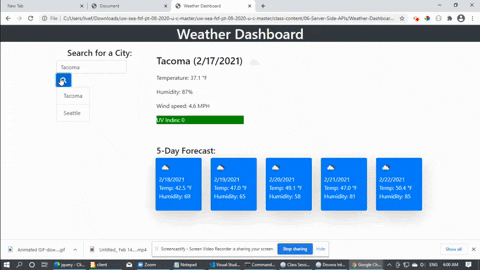

# Weather-Dashboard

## Description
This weather dashboard displays the current weather data and the forecasted weather data for the next five days for a searched for location. Searches are saved in local storage so that the user can quickly get its weather data and the searches are not lost when refreshing the webpage.
## Visuals

## Repository / Deployment
Repository is located [here](https://github.com/awpdev/Weather-Dashboard).

Weather Dashboard has been deployed [here](https://awpdev.github.io/Weather-Dashboard/).

## Installation

## Usage
Enter a city under 'Search for a City' and click on the search button to get its weather data. Clicking on 

## Questions

## Credits
https://www.dovora.com/resources/weather-icons/ (weather icons)

https://stackoverflow.com/questions/6658752/click-event-doesnt-work-on-dynamically-generated-elements

Trilogy Education code examples
## License
